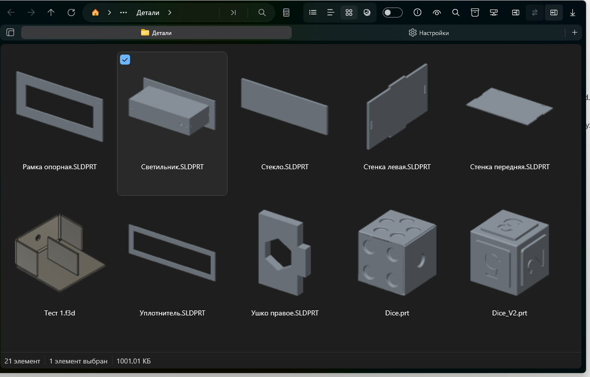
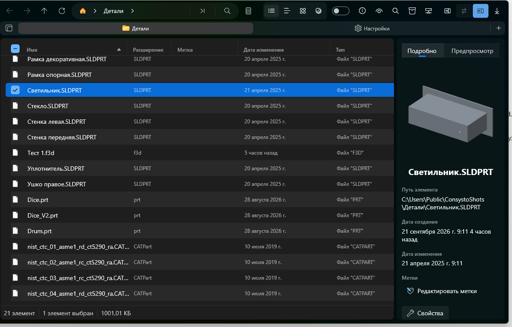
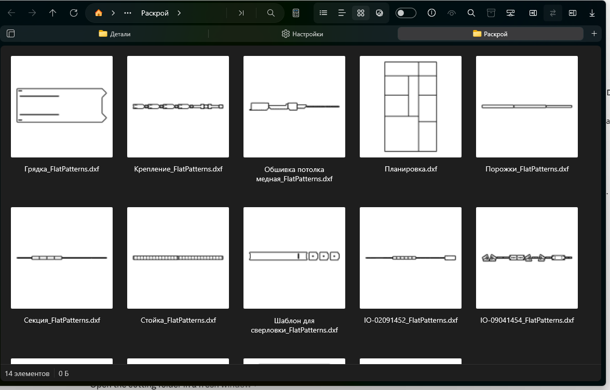
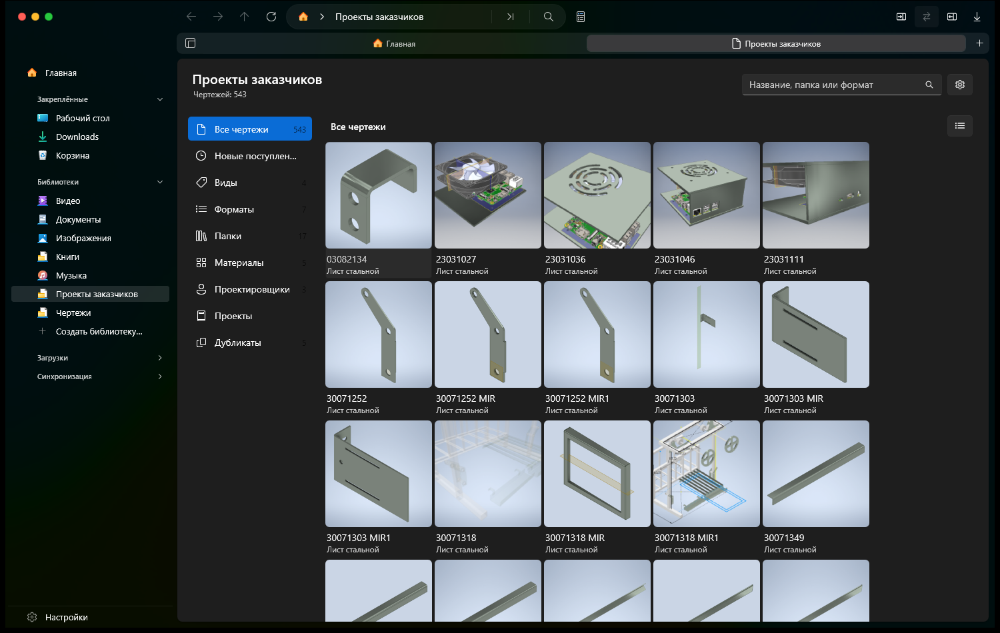
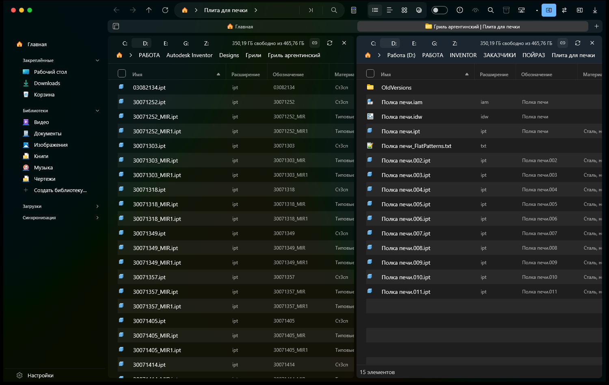
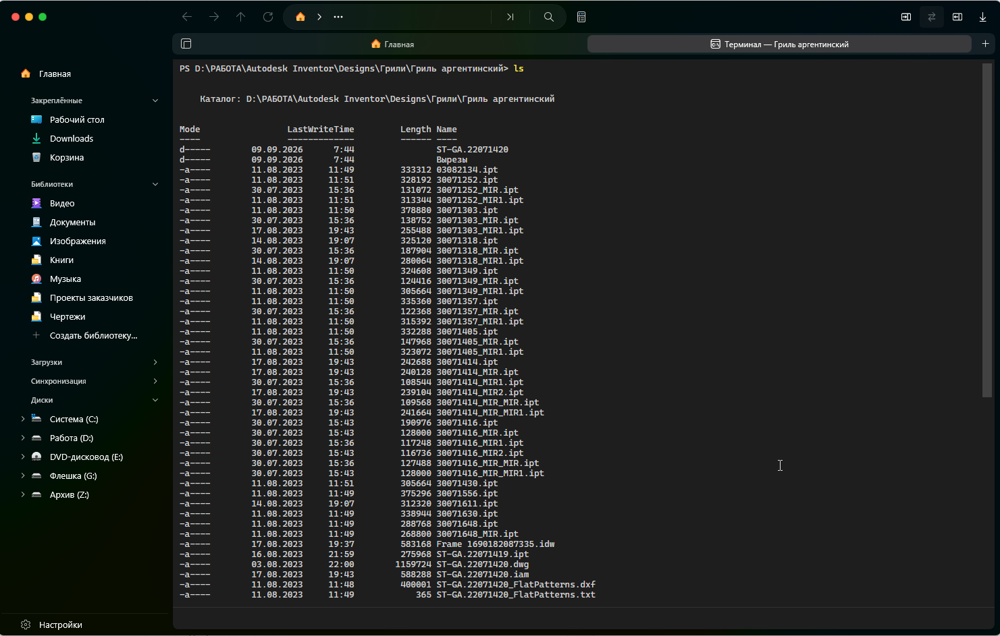

# Consysto Files

A file manager for Windows 11 that shows what is inside your files — CAD models and drawings, Illustrator and CorelDRAW artwork, e-books, music and photos — without the programs that made them. On top of that: collections over your folders, a terminal tab, a built-in torrent client, folder backups and a proper two-pane mode for those who grew up on Total Commander.

**It is built on [Files](https://github.com/files-community/Files) by Files Community.** I chose Files because it already is a good modern file manager — tabs, panes, a preview pane, a clean Windows 11 interface. Everything listed under "What is added" below is my work on top of it; the rest belongs to the Files authors.

I am a mechanical designer, and this project started from what my own work kept needing. The program is free and open. This is an early version: it works, but rough edges are still there, and reports about them are welcome.

[**Download a ready build**](https://github.com/egorcha174/ConsystoFiles/releases) · Русская версия — [README.ru.md](README.ru.md)



*A folder of parts from several CAD systems. None of those systems is installed.*

## What is added to Files

**Drawings and models.** Shown in the preview pane without starting a CAD system, and without having one installed:

- **DWG and DXF** — the drawing itself is redrawn, outlines and lines;
- **Inventor** — parts, assemblies, drawings, presentations;
- **SolidWorks, KOMPAS-3D, Autodesk Fusion, Siemens NX, CATIA, Rhino, FreeCAD** — the part appears as a model that can be turned with the mouse; where the format is closed and the geometry cannot be reached, the picture the program itself saved inside the file is shown instead;
- **STEP and IGES** — exchange formats, tessellated by the Open CASCADE engine.

**An Inventor assembly opens like a folder.** Inside are the parts and subassemblies it uses; the parts stay ordinary files on disk, and references that cannot be found are shown as missing.

**Artwork.** Illustrator (`.ai`, saved PDF-compatible, which is the default) and CorelDRAW (`.cdr`, old and new versions) are shown by the picture stored inside the file. Neither program is started, and nothing inside the file is run.

Columns carry the properties that matter: part code, material, mass, and the version of the program the file was last saved in. The same properties can be filtered on.

**Collections.** Libraries built on top of folders — books, pictures, music, drawings. Files stay where they are; only an index is built. Indexing shows its progress and the folder it is working through. Duplicates are found by sampling file contents, not by name alone.

**Books.** Covers and details from FB2, EPUB, PDF and DjVu. An OPDS client for other people's catalogues, and an OPDS server for your own collection, which any reader app on a phone can open.

**A terminal in a tab.** A real Windows console inside the window, next to the folders.

**Torrents.** Downloads run inside the program, with their own section: a list, filters, files, peers and trackers. Magnet links and `.torrent` files can be opened straight into it.

**Synchronisation and backups.** Comparison of two folders, copying of the differences, and backup plans with a preview of exactly what will be copied and what will be deleted.

**Control from other programs.** The window can be driven by commands from outside: open a folder in a chosen pane, split the window into two panes, open the terminal or the downloads, make a collection or a backup plan, start a download. It is off by default and is switched on under Settings → Advanced. See the [description of the control channel](build/consysto/api/README.md).

**Two panes.** Files already has two panes; here they get a header with drives and free space, swapping sides, moving through folders in step, copying or moving straight to the other pane, and comparing the two open folders.

## The portable build

Unpack the archive anywhere and run `Files.exe`. No installation, no administrator rights.

Everything the program keeps — settings, collection indexes, thumbnails — lives in a `data` folder next to it. Nothing is written to the Windows registry or to your profile: delete the folder and nothing of it remains.

What the system needs: Windows 11, or Windows 10 version 1809 or newer. Nothing has to be installed alongside; every library ships in the folder. The one exception is the terminal, which needs the WebView2 component: Windows 11 always has it, Windows 10 may not.

What the portable build does not do: replace File Explorer on Win+E, show Windows notifications, or update itself through the Store. Updating means replacing the folder — keep your `data` folder, your settings are in it.

## Building from source

Visual Studio 2022 or newer with the Windows development workload, and the .NET 10 SDK.

```powershell
build\consysto\Build-ConsystoPortable.ps1
```

The script builds the portable version and puts the folder and a `.zip` into `artifacts\ConsystoFiles`. For an installable package there is `build\consysto\Build-ConsystoFiles.ps1`, which needs a signing certificate.

### The demonstration build

A separate build switch (`-p:ConsystoDemo=true`) produces a variant where the names of the
drives and of the computer are replaced by plain ones — "System (C:)", "Work (D:)",
"Archive (Z:)". Nothing else changes: the files, the folders and their properties stay real.

This is meant for screenshots and for showing the program: one can see how it works with
real files without seeing how the owner's drives are named. The code is left out of ordinary
builds.

## What it looks like

**Model preview.** A SolidWorks part opened as real geometry — it can be turned and looked at from the other side.



**Drawings for cutting.** DXF flat patterns are visible in the folder itself, without opening each one.



**A collection of drawings.** An index over several folders: 543 drawings with previews, materials and filters. The files stay where they are.



**Two panes.** A header with drives above each one, swapping sides, moving through folders together.



**A terminal tab.** A real console next to the folders.



## Licences and credits

The foundation is [Files](https://github.com/files-community/Files) by Files Community, under MPL-2.0 (see `LICENSE-MPL`); some parts are under MIT (`LICENSE-MIT`). My changes are released under the same licences.

This project is not affiliated with Files Community and is not supported by them. Every rough edge in this build is mine, not theirs. The name and the icon of this fork are its own; the Files name and logo are not used.

Thanks to the authors of Files and of the libraries everything rests on: ACadSharp, MonoTorrent, OpenMcdf, Win2D, CommunityToolkit.

The geometry of SolidWorks parts is read by [cadmpeg](https://github.com/cadmpeg/cadmpeg) under the Apache-2.0 licence. It sits as a separate program in the `CadHelpers` folder next to Files and runs only while a file is being read; its licence is there too.

## Saying thank you

The program is free and will stay that way. If it saved you time and you would like to say thanks:

- [CloudTips](https://pay.cloudtips.ru/p/c83072e9) — Russian cards and transfers, no account needed.
- [Boosty](https://boosty.to/egorcha/donate)

There is no GitHub Sponsors button and there will not be one: it does not work from Russia. Neither page accepts cards issued outside Russia, so from abroad the kind thing is a bug report rather than money.

## Feedback

Found a bug — please open an issue. It helps a lot to attach `data\Local\debug.log`, or, in the installed version, the report that Settings → About → "Save an error report" puts on your desktop.
