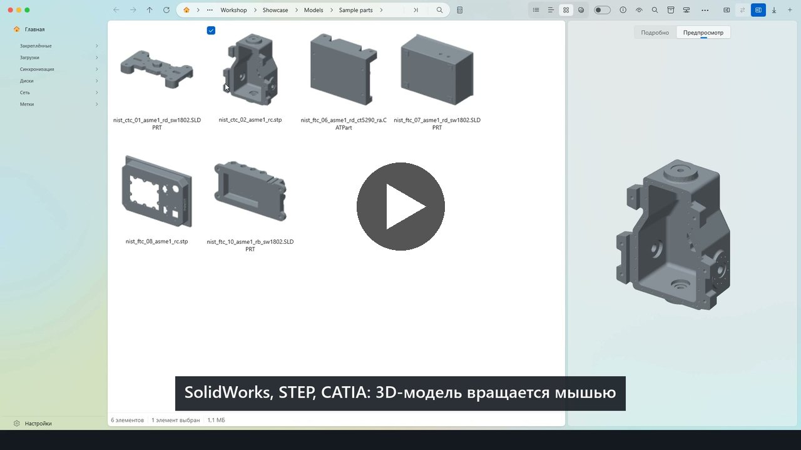
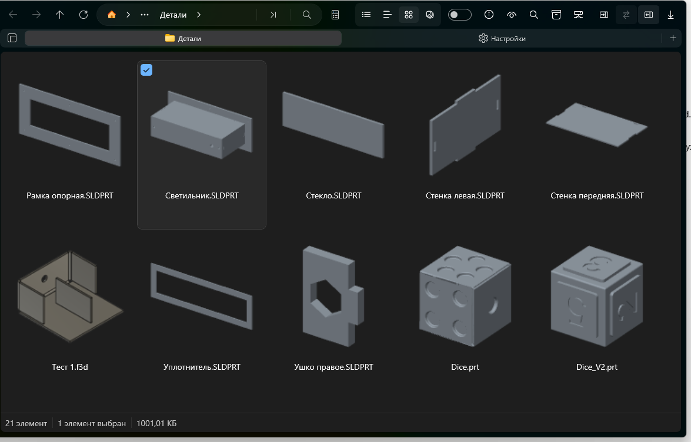
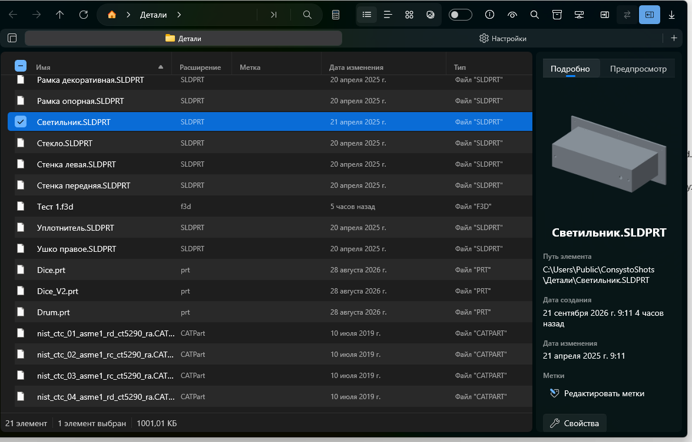
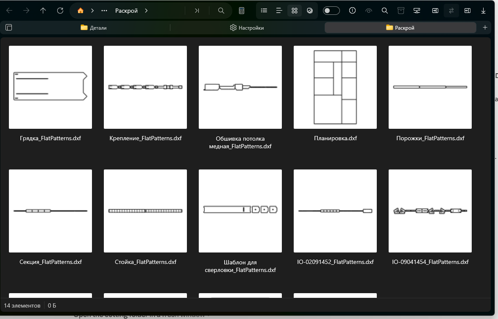
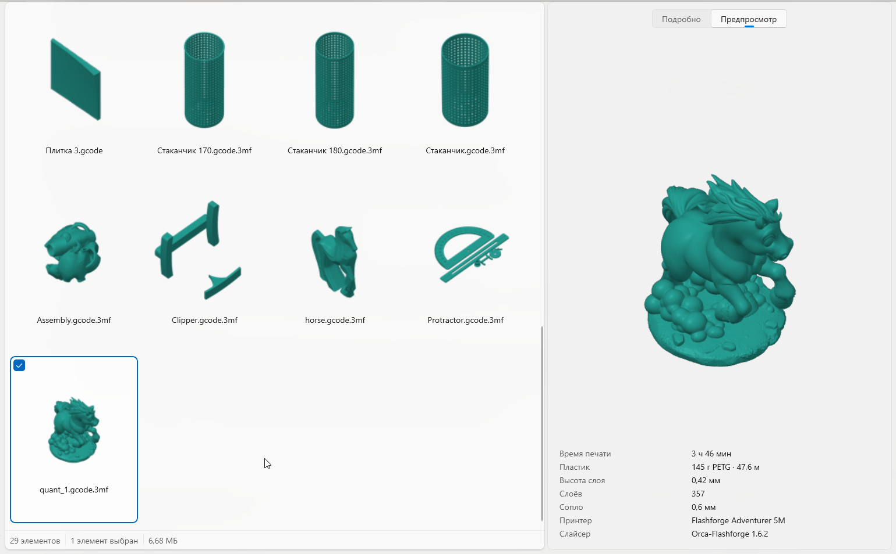
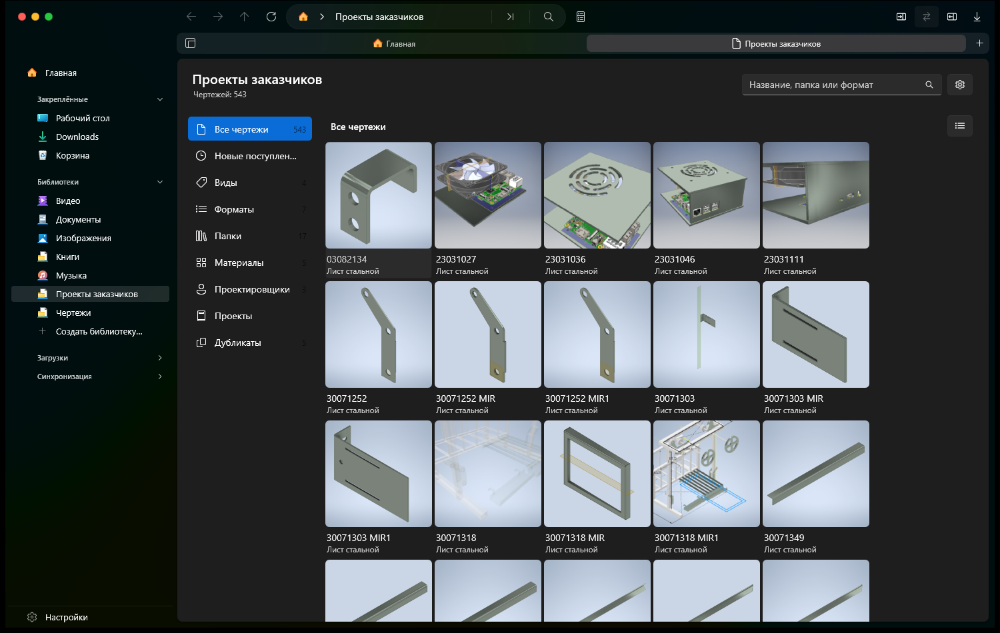
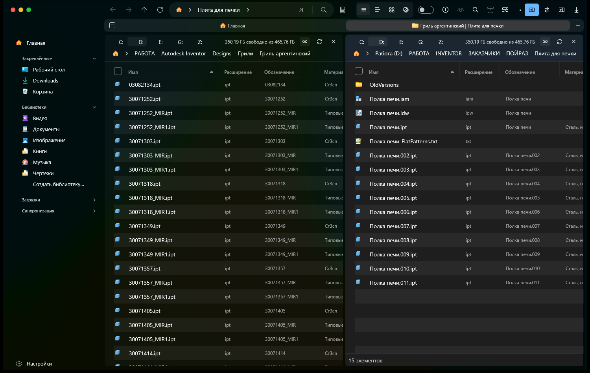
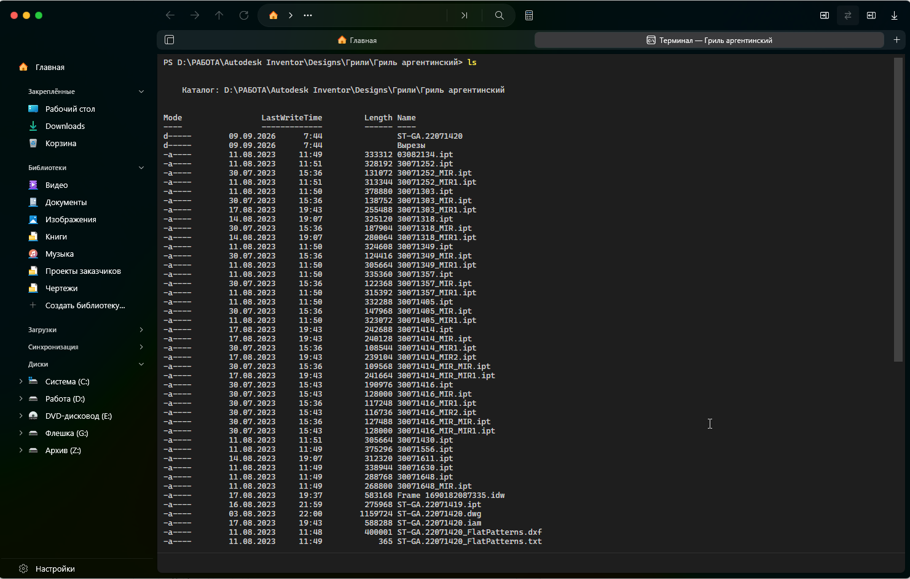

# Consysto Files

Файловый менеджер для Windows 11 — форк [Files](https://github.com/files-community/Files) с тем, чего мне не хватало в работе конструктора: просмотр чертежей и файлов 3D-печати, свои коллекции, встроенный терминал, торренты и синхронизация папок.

Проект открытый и бесплатный. Сейчас это ранняя версия: она работает, но встречаются шероховатости, и я буду рад сообщениям о них.

**[⬇ Скачать (zip)](https://github.com/egorcha174/ConsystoFiles/releases/latest)** — распакуйте и откройте `Запустить Consysto Files.cmd`. Синее окно «Система Windows защитила ваш компьютер»? *Подробнее → Выполнить в любом случае*. [По шагам](https://github.com/egorcha174/ConsystoFiles/releases/latest)

[**Подробный обзор, сценарий за сценарием**](docs/review.ru.md) · English version — [README.md](README.md)

**Ролик на две минуты**

[](https://youtu.be/Eyohi4TW5ZI)

*[Смотреть на YouTube](https://youtu.be/Eyohi4TW5ZI) (2:16) · на английском: [youtu.be/z5Z5ccec0II](https://youtu.be/z5Z5ccec0II). Голос синтезированный, детали в ролике — открытые тестовые модели NIST.*



*Папка с деталями из разных CAD-систем. Ни одна из них в системе не установлена.*

## Что добавлено к Files

**Чертежи и модели.** Просмотр прямо в панели, без запуска CAD и без установленных CAD-систем:

- **DWG и DXF** — рисуется сам чертёж, контуры и линии;
- **Inventor** — детали, сборки, чертежи, презентации;
- **SolidWorks, КОМПАС-3D, Autodesk Fusion, Siemens NX, CATIA, Rhino, FreeCAD** — деталь видно моделью, её можно вращать мышью; где формат закрыт и геометрию не достать, показывается картинка, сохранённая внутри файла самой программой;
- **STEP и IGES** — обменные форматы, разбиваются на треугольники движком Open CASCADE.

**Parasolid (`.x_t`, `.x_b`) не поддерживается, и вот почему.** Мы пробовали. Единственный открытый читатель, [parasolid-kit](https://github.com/monozukuri-ai/parasolid-kit), знает лишь несколько версий схемы данных Parasolid, а все настоящие файлы, которые мы проверяли (экспорт из Onshape и других CAD), записаны по схемам, которых он не знает; каталоги схем идут с установками CAD-программ, и распространять их нельзя. Кроме того, читателю нужно около 250 МБ помощников (Python и Open CASCADE) — больше, чем весь Files, а чужие файлы мы запускаем только в изолированной песочнице, которая проверку ещё не прошла. Код остаётся в репозитории, но выключен по умолчанию (собирается только с `-WithParasolid`); такие файлы показываются как «Не поддерживается», как и любые другие файлы без превью.

**Сборка Inventor открывается как папка.** Внутри — детали и подсборки, из которых она состоит; сами детали остаются обычными файлами на диске, а ненайденные ссылки показываются отдельно.

**Макеты.** Illustrator (`.ai`, сохранённый PDF-совместимым — так по умолчанию) и CorelDRAW (`.cdr`, старые и новые версии) показываются картинкой, которая хранится в самом файле. Ни одна из программ не запускается, и ничего внутри файла не исполняется.

Колонки со свойствами: обозначение, материал, масса, версия программы, в которой сохранён файл. Фильтры по этим свойствам.

**3D-печать.** G-code (`.gcode`, `.gco`, `.g`), двоичный `.bgcode` PrusaSlicer, `.gx` FlashPrint и нарезанные проекты `.gcode.3mf` из Flash Studio, OrcaSlicer, Bambu Studio, PrusaSlicer и Cura:

- в папке у каждого задания миниатюра, которую сохранил слайсер; задание без картинки рисуется по ходам сопла;
- в панели просмотра — траектории в изометрии, цветом от стола к верхнему слою, и сведения: время печати, пластик (граммы, тип, метры), высота слоя, число слоёв, сопло, принтер, слайсер;
- в таблице — колонка «Время печати» рядом с материалом, массой и версией: папку заданий можно отсортировать по времени или по расходу пластика.

Читаются только начало и конец файла G-code, поэтому папка с большими заданиями открывается быстро.

**Коллекции.** Свои библиотеки поверх папок — книги, изображения, музыка, чертежи. Файлы остаются на месте, собирается только указатель. Видно ход индексации и то, какая папка обрабатывается сейчас. Копии находятся сравнением по пробам, а не по одному имени. С элементами коллекции работают как с файлами в папке: выделение щелчком, с Ctrl и Shift, Ctrl+A или галочкой в углу плитки; копировать, вырезать, удалить, открыть, показать в папке, скопировать путь — кнопками над списком, из меню по правой кнопке или клавишами; перетащить мышью в любую папку. Информационная панель показывает выбранный элемент крупно, со сведениями.

**Книги.** Обложки и сведения из FB2, EPUB, PDF и DjVu. Клиент OPDS для чужих каталогов, и раздача своей коллекции по OPDS — с телефона её открывает любая читалка.

**Терминал во вкладке.** Настоящая консоль Windows внутри окна, рядом с папками.

**Торренты.** Закачка внутри программы, отдельный раздел со списком, фильтрами, файлами, пирами и трекерами. Магнет-ссылки и `.torrent` можно открывать сразу в ней.

**Синхронизация и резервные копии.** Сравнение двух папок, копирование различий, планы резервного копирования с предпросмотром — что именно будет скопировано и удалено.

**Управление из других программ.** Окно можно вести командами снаружи: открыть папку в нужной панели, развернуть окно на две панели, открыть терминал или загрузки, завести коллекцию или план резервной копии, начать закачку. По умолчанию выключено, включается в «Настройки → Дополнительно». Подробности — в [описании канала управления](build/consysto/api/README.md).

**Два стиля оформления.** По умолчанию окно оформлено в духе Finder на macOS: круглые кнопки окна слева, вкладки как в Safari, строки через одну подкрашены. В «Настройки → Внешний вид → Стиль оформления» можно выбрать обычный вид Windows 11: кнопки окна справа, стандартные вкладки, системные цвета. Применяется после перезапуска, кнопка «Перезапустить» появляется там же.

**Две панели.** Шапка над каждой панелью с дисками и свободным местом, обмен панелей местами, синхронное перемещение по папкам, сравнение открытых папок.

## Портативная версия

Распакуйте архив в любую папку и запустите `Запустить Consysto Files.cmd`. Приложение находится в `app\Files.exe`; инструкция — в `КАК ЗАПУСТИТЬ - HOW TO START.txt`. Установка не нужна, права администратора не нужны.

Все данные — настройки, указатели коллекций, значки — лежат в папке `app\data` рядом с `Files.exe`. Программа не пишет ни в реестр Windows, ни в ваш профиль: удалили папку — не осталось ничего.

Что должно быть в системе: Windows 11 (или Windows 10 версии 1809 и новее). Ничего доустанавливать не нужно — все библиотеки лежат в папке программы. Исключение одно: терминалу нужен компонент WebView2, в Windows 11 он есть всегда, в Windows 10 может отсутствовать.

Чего в портативной версии нет: замены Проводника по Win+E, уведомлений Windows и обновления через магазин. Перед обновлением закройте программу и сохраните папку `app\data`, в ней ваши настройки. При переходе со старой раскладки скопируйте прежнюю папку `data` в `app\data` новой сборки до первого запуска.

## Сборка из исходников

Нужны Visual Studio 2022 или новее с рабочей нагрузкой разработки для Windows и .NET 10 SDK.

```powershell
build\consysto\Build-ConsystoPortable.ps1
```

Скрипт собирает портативную версию и складывает папку и `.zip` в `artifacts\ConsystoFiles`. Для установочного пакета есть `build\consysto\Build-ConsystoFiles.ps1`, ему нужен сертификат подписи.

### Демонстрационный режим

Отдельным ключом сборки (`-p:ConsystoDemo=true`) собирается вариант, в котором названия
дисков и имя компьютера заменяются на условные — «Система (C:)», «Работа (D:)»,
«Архив (Z:)». Больше он не меняет ничего: файлы, папки и свойства остаются настоящими.

Это нужно для снимков экрана и показа программы: видно, как она работает с реальными
файлами, но не видно, как названы диски у владельца. В обычные сборки этот код
не попадает.

## Как это выглядит

**Просмотр модели.** Деталь SolidWorks открыта настоящей геометрией — её можно повернуть и посмотреть с другой стороны.



**Чертежи под раскрой.** Развёртки DXF видно прямо в папке, без открытия каждой.



**Задания 3D-печати.** Нарезанные проекты видно по миниатюрам из слайсера; в панели просмотра — время печати, пластик, высота слоя, сопло, принтер и слайсер.



**Коллекция чертежей.** Указатель поверх нескольких папок: 543 чертежа с картинками, материалами и фильтрами. Файлы остаются на месте.



**Две панели.** Шапка с дисками над каждой, обмен местами, синхронное перемещение.



**Терминал во вкладке.** Настоящая консоль рядом с папками.



## Лицензии и благодарности

Основа — [Files](https://github.com/files-community/Files) от Files Community, лицензия MPL-2.0 (см. `LICENSE-MPL`); отдельные части — под MIT (`LICENSE-MIT`). Мои изменения выходят под теми же лицензиями.

Проект не связан с Files Community и не поддерживается ими. За все шероховатости этой сборки отвечаю я, а не они. Название и значок этого форка — свои; имя и логотип Files не используются.

Спасибо авторам Files и библиотек, на которых всё держится: ACadSharp, MonoTorrent, OpenMcdf, Win2D, CommunityToolkit.

Геометрию деталей SolidWorks читает [cadmpeg](https://github.com/cadmpeg/cadmpeg) под лицензией Apache-2.0. Он лежит отдельной программой в папке `CadHelpers` рядом с Files и запускается только на время чтения файла; его лицензия — там же.

Экспериментальный помощник Parasolid, которого нет в выпущенных сборках, использует **parasolid-kit 0.3.7** (`MIT AND Apache-2.0`) со штатными встроенными профилями; сторонние каталоги схем не включаются. Преобразование геометрии использует OCP (Apache-2.0) и Open CASCADE Technology (LGPL-2.1 с исключением OCCT). Сборка с `-WithParasolid` включает автономный Python-runtime, тексты лицензий, архивы исходников библиотек и сценарии их сборки.

## Поблагодарить

Программа бесплатная и останется такой. Если она сберегла вам время и хочется сказать спасибо:

- [CloudTips](https://pay.cloudtips.ru/p/c83072e9). Картой или через СБП, регистрация не нужна.
- [Boosty](https://boosty.to/egorcha/donate)
- [lava.top](https://app.lava.top/egorcha?donate=open). Для карт, выпущенных за рубежом: принимает из 95+ стран.

Привычной для открытых проектов кнопки GitHub Sponsors тут нет и не будет: из России она не работает.

## Обратная связь

Нашли ошибку — напишите в разделе Issues. Полезно приложить `data\Local\debug.log` или отчёт, который кладёт на рабочий стол кнопка «Настройки» → «О программе» → «Сохранить отчёт об ошибке».
