# A closer look at Consysto Files

This page goes through what Consysto Files actually does, scenario by scenario, with what it doesn't do yet named just as plainly. The short version is in the [README](../README.md); this is the long one, written the way an independent reviewer would write it — not a feature list to sell you something, but a record of what was tested and on what.

**The foundation is [Files](https://github.com/files-community/Files) by Files Community**, MPL-2.0/MIT, a modern Windows 11 file manager: tabs, panes, a preview pane, a clean interface, actively developed. I picked it up because it already solved the boring half of the problem well. Everything below the first section is what I added on top of it; the first section is Files' own work, credited as such.

I am a mechanical designer, not a software company. This project grew out of what my own work kept needing — mainly reading other people's CAD files without their CAD systems installed — and then grew past that once I saw what else the same file manager could carry. It is free, it stays free, and it is an early build: rough edges are still there.

## Who this is for

The same program reads differently depending on who opens it:

- **Anyone replacing File Explorer** gets tabs, panes, a fast preview pane and file operations that Files already provides — see [Foundation](#foundation-what-files-already-does) below.
- **Total Commander / Norton Commander veterans** get an actual two-pane workflow on top of that foundation — [Two panes](#two-panes).
- **Engineers and designers** get CAD drawings and models previewed without the CAD software installed — [Drawings and models](#drawings-and-models), [Inventor assemblies](#an-inventor-assembly-opens-like-a-folder), [Part properties](#part-properties-in-columns).
- **Anyone who gets artwork files from clients** gets Illustrator and CorelDRAW shown without those programs — [Artwork](#artwork-illustrator-and-coreldraw).
- **Readers and collectors** get a library layer over plain folders — [Collections](#collections), [Books and OPDS](#books-and-opds).
- **Anyone who downloads things** gets a torrent client inside the file manager — [Torrents](#torrents).
- **People who back things up by hand** get folder comparison and backup plans — [Sync and backups](#sync-and-backups).

## Foundation: what Files already does

Tabs, a sidebar, an address bar, file operations with progress and undo, archive handling, Git status in a folder, tags, themes, and switchable layouts (list, grid, columns) — none of this is mine. It's a strong, actively maintained base, and it's the reason this fork exists instead of a file manager built from nothing. If you already know Files, skip to the sections below; everything past this point is what changed.

## Drawings and models

**Problem.** A folder full of parts from a client — SolidWorks, KOMPAS-3D, Inventor, whatever they use — shows blank icons. Every one of them needs its own CAD program open just to see what's inside.

**What it does.** The preview pane and the thumbnail grid draw the actual drawing or model, with no CAD system installed and none started:

- **DWG and DXF** — the drawing is redrawn: outlines, lines, the flat pattern a laser or a plasma table would cut.
- **STEP and IGES** — exchange formats, tessellated by the Open CASCADE engine.
- **STL, OBJ, 3MF** — the mesh is read directly and shown as a model you can turn with the mouse.
- **SolidWorks, KOMPAS-3D, Autodesk Fusion, Siemens NX, CATIA, Rhino, FreeCAD** — where the geometry can be reached, the part appears as a real model, turnable, not a flat picture; where the format is closed and only a picture is stored inside the file, that picture is shown instead.
- **Autodesk Inventor** — parts, assemblies, drawings and presentations, read natively.

**Mechanism.** Two different roads, because CAD vendors solve this two different ways. Some formats carry a ready-made mesh inside the file — read it, done. Others carry only exact mathematical surfaces, and there is no mesh until someone tessellates them; for those, Open CASCADE does the work, and the program keeps whichever result — carried mesh or freshly tessellated one — has more detail. SolidWorks and KOMPAS-3D geometry is read by [cadmpeg](https://github.com/cadmpeg/cadmpeg) (Apache-2.0), running as a separate helper process only while a file is open.

**Limitation.** Creo opens but returns broken geometry — a handful of triangles instead of a part — so it is deliberately switched off rather than shipped wrong. Where a format only carries a picture and not real geometry (some SolidWorks and Fusion files, for instance), that picture is what you get, not a model.

**Evidence.** Tested against real files, not a handful of samples: 71 of 71 SolidWorks parts, 408 of 408 KOMPAS-3D documents (parts, assemblies and drawings alike), 67 of 72 Siemens NX parts, 17 of 19 CATIA parts from NIST's own hard reference set, and one real Autodesk Fusion file.

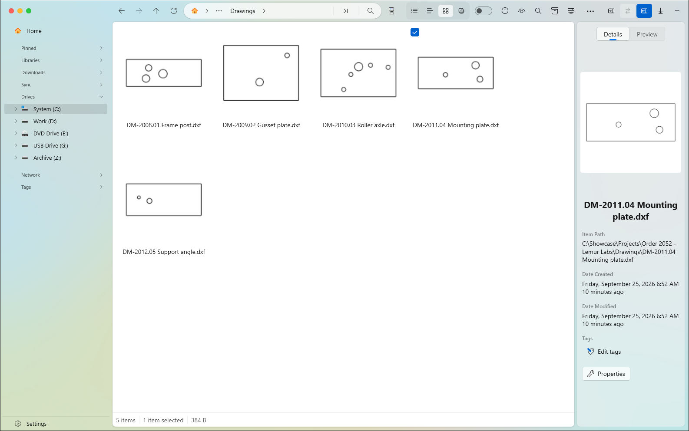

*A folder of flat-pattern DXF drawings — no CAD program running, nothing installed.*

## An Inventor assembly opens like a folder

**Problem.** An Inventor assembly is one `.iam` file, but it's really a pointer to a pile of part files scattered elsewhere on disk. Explorer shows you the one file and tells you nothing about what it's made of, or whether all of it is even still there.

**Action.** Open the assembly the way you'd open a folder.

**Result.** Inside are the parts and subassemblies it actually references — real files, in their real locations — with part number, material, mass and the Inventor version they were last saved in as columns you can filter on. A reference that can't be found on disk shows up as missing instead of silently vanishing.

**Limitation.** The parts aren't copied or moved into the assembly — this is a view of what's really there, not a container.

**Evidence.**

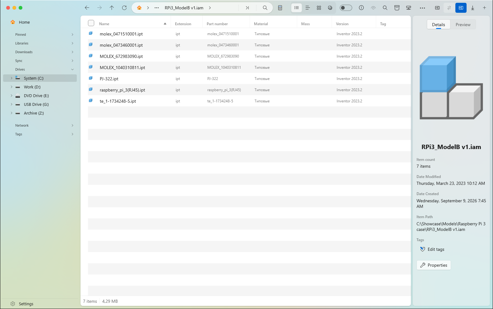

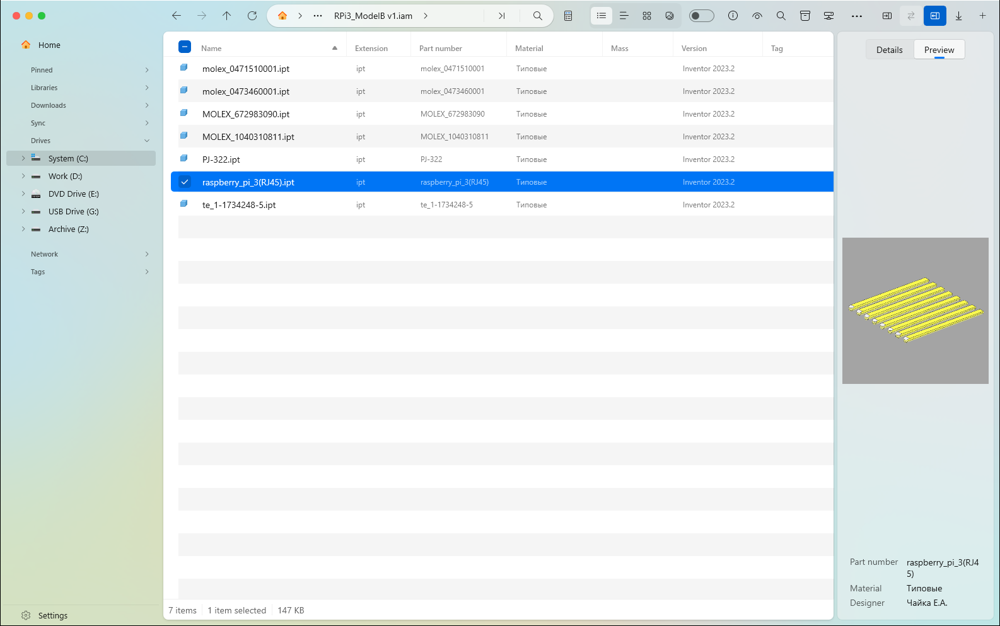

## Part properties in columns

Part number, material, mass, and the exact version of the CAD program the file was last saved in — pulled from files that store this, shown as sortable, filterable columns next to the usual name and date. Useful the moment a folder has more than a handful of parts and you're looking for "the aluminium one" or "everything saved in the 2023 version."

## Artwork: Illustrator and CorelDRAW

**Problem.** A cutting or engraving job arrives as a `.ai` or `.cdr` file, and neither Illustrator nor CorelDRAW is installed on the machine doing the cutting. The folder shows a blank icon.

**Action.** Look at the file in the preview pane, same as anything else.

**Result.** The artwork is shown — the page for Illustrator, the stored picture for CorelDRAW — without either program starting and without anything inside the file being executed.

**Mechanism.** An Illustrator file saved the ordinary way (the default since early versions) is, underneath, a PDF; its first page *is* the artwork, and Windows' own PDF engine draws it. CorelDRAW carries its own picture inside the file, but where and how differs by era: newer documents are a ZIP archive with the picture under `previews/thumbnail.png`; older ones are a different archive layout with it under `metadata/thumbnails/thumbnail.bmp`; the oldest are a raw RIFF container, and getting the picture out of those required stepping past a four-byte form type in the header that a naive read walks straight through.

**Limitation.** Old-style Illustrator files (PostScript-based, not PDF-compatible) aren't read — there's no PDF inside them to draw. Plain EPS is not supported yet: every EPS file tested (five, including public samples) turned out to carry no embedded picture at all, and nothing was written against files that couldn't be verified against.

**Evidence.** Tested against a reader's own Illustrator file, two CorelDRAW documents from different eras, and a public Corel sample file.

## Collections

**Problem.** Files that matter to you — a growing library of parts, photos, books, or music — are scattered across folders, and Explorer has no concept of "my collection" spanning several of them.

**Action.** Point a collection at one or more folders.

**Result.** An index builds over them — with visible progress and which folder is currently being scanned — without moving or copying a single file. Duplicates are found by sampling file contents, not just by matching names.

**Evidence.** A collection built from several customer-project folders indexed 543 drawings, with previews, materials and format filters, in the existing screenshot on the [README](../README.md).

## Books and OPDS

**Problem.** An ebook collection is just files in a folder until something reads their metadata; and getting your own books onto a phone usually means a separate sync app.

**Action / result.** Covers and details are read from FB2, EPUB, MOBI, PDF and DjVu. An OPDS client lets you browse and download from other people's public catalogues from inside the file manager. An OPDS server does the reverse: it serves your own book collection over the local network, so any OPDS-capable reader app on a phone (FBReader, Librera, and others) can browse and download from it directly, with no separate app to install on the desktop side.

**Limitation.** The OPDS server side is not yet verified against a real phone reader app — noted here rather than left unsaid.

**Evidence.** Project Gutenberg's public OPDS catalogue, browsed live: a book list, a book's detail page with its cover, and EPUB/MOBI download links.

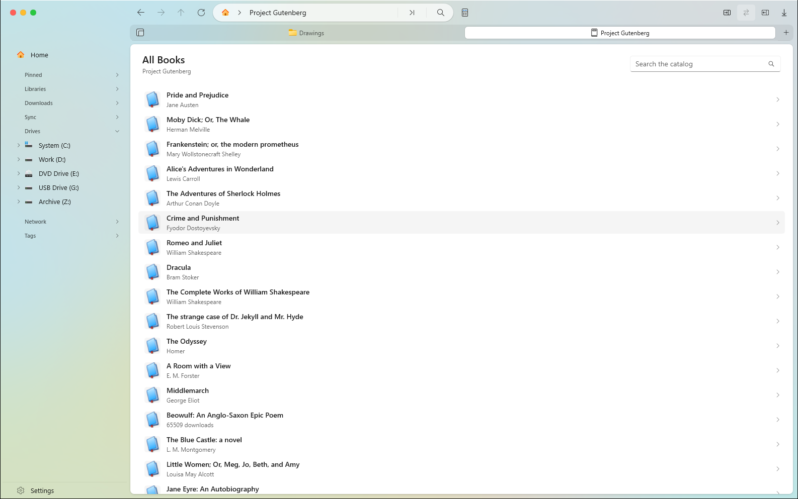

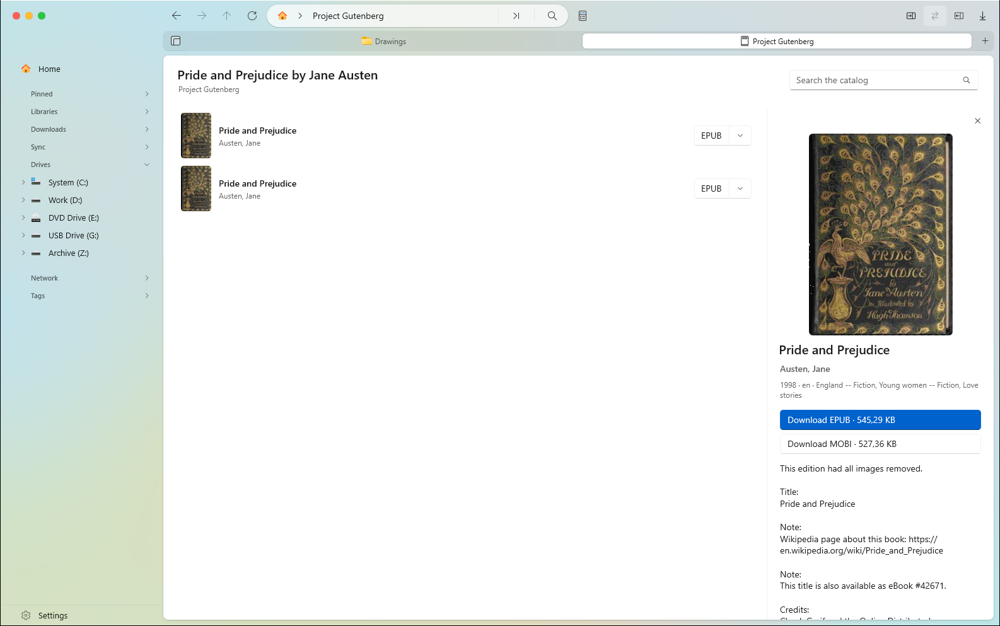

## Media: photos and music

Photo previews read EXIF; music previews read ID3, FLAC, Ogg and MP4 tags. Both feed the same collection and column system as everything else — a music or photo library is a collection like a drawing library is, filterable on its own metadata.

## A terminal in a tab

A real Windows console, opened as an ordinary tab next to your folders, starting in whatever folder you opened it from — no separate terminal window to manage, no `cd` typed out by hand.

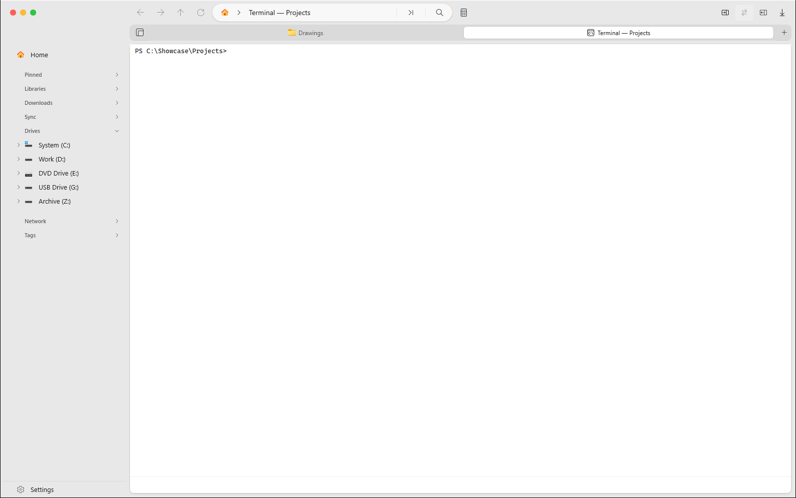

## Torrents

**Problem.** Downloading something large usually means a separate program, its own window, its own place to remember to check on.

**Action / result.** Magnet links and `.torrent` files open straight into a torrent section inside the file manager: a list, per-download files, peers and trackers, speed and ETA.

**Limitation.** This is a client for downloads you already intend to make, not a search tool — nothing is found or suggested from inside the program.

**Evidence.** A real download (a public Debian installer image) at roughly 8 MB/s, seeds and peers visible, ETA counting down.

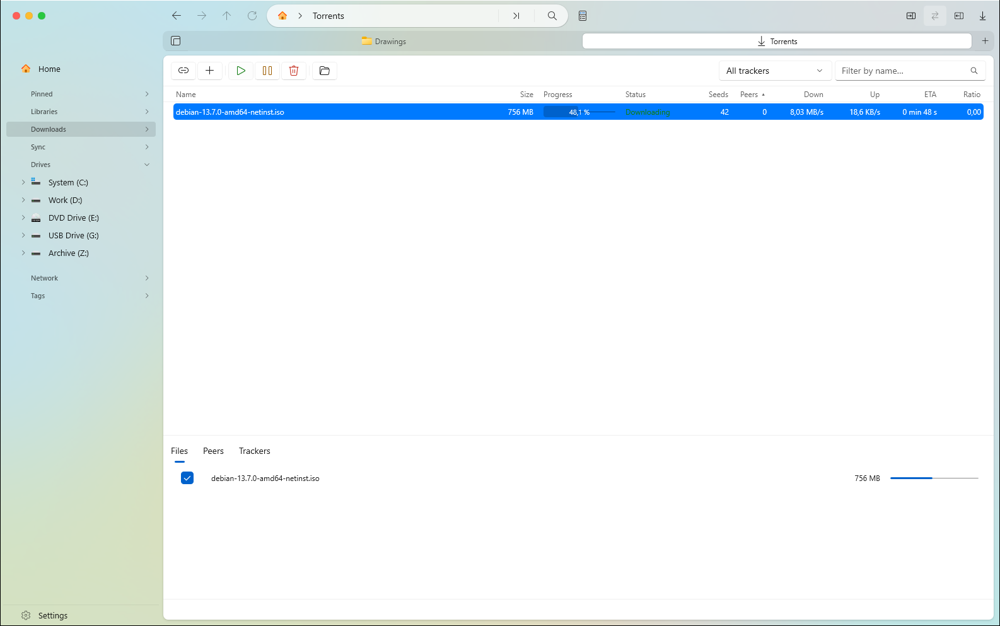

## Sync and backups

**Problem.** "Did I actually back up my latest changes?" is usually answered by copying everything again and hoping, or by eyeballing file dates.

**Action.** Compare two folders, or set up a standing backup plan between them.

**Result.** Before anything is copied, you see exactly what's new, what changed, and what exists only on one side — file by file, with the option to flip the direction of any individual item before committing to a copy.

**Evidence.** A comparison between a project folder and its backup correctly found one changed file and one missing file among several identical ones; a backup plan's check step listed 11 files to copy, split into new and changed, before anything was written.

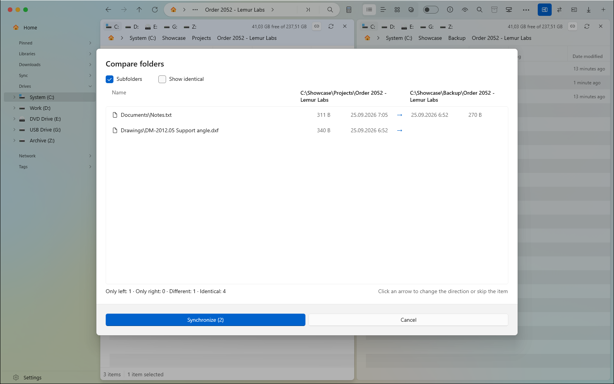

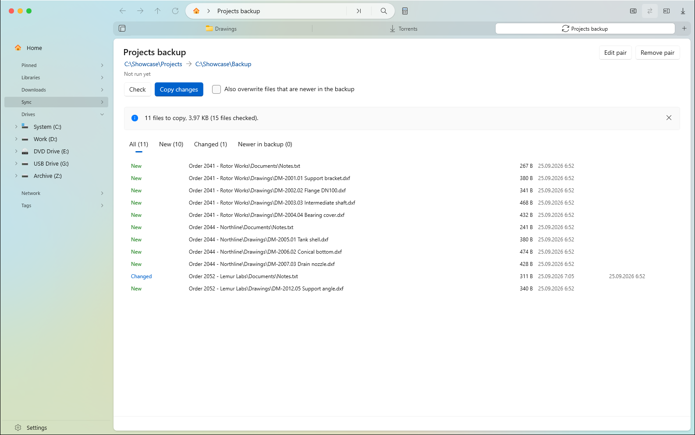

## Two panes

Files already has two panes; this fork adds what Total Commander and Norton Commander users expect from them: a header over each pane showing its drive and free space, swapping the panes, moving through folders in the two panes together, copying or moving straight to the other pane with one action, and the folder comparison described above.

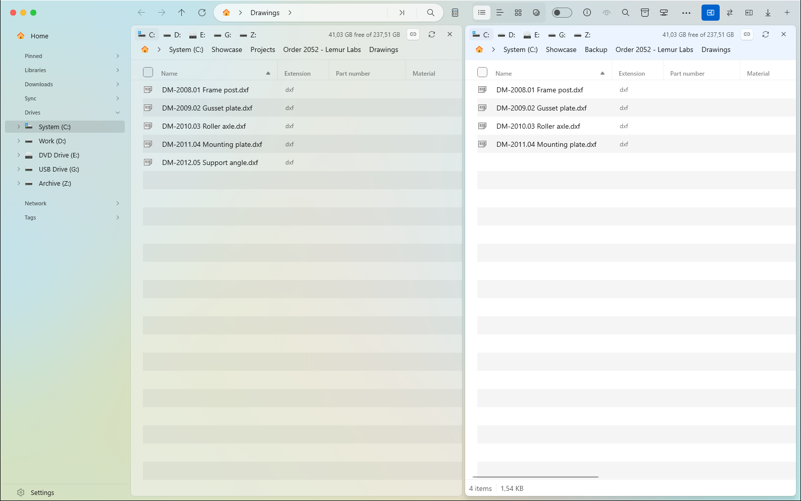

## Quick preview

Press Space (or F3) on a selected file to see it full-size in an overlay, without opening a tab or a separate app — the same slot other file managers use for Quick Look-style previews.

**Limitation.** The preview is currently offset slightly to the right in the overlay window; a cosmetic issue being fixed.

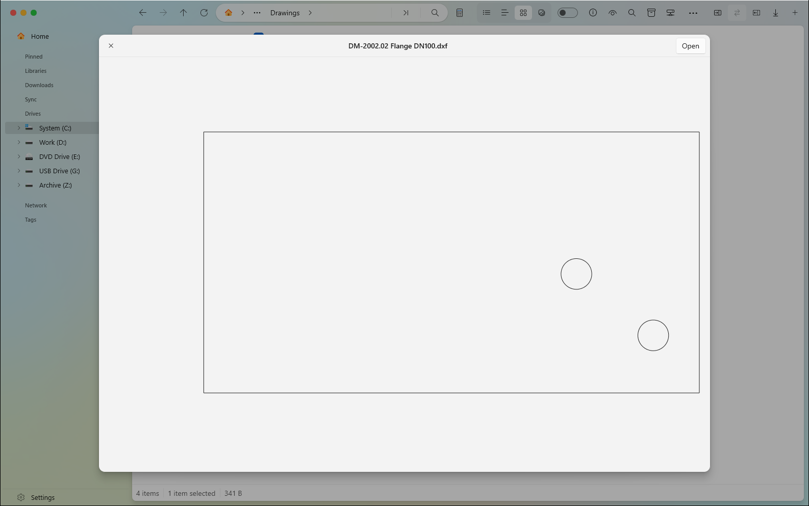

## Control from other programs

**Problem.** Sometimes you want another program — a script, a build tool, a custom workflow — to drive the file manager: open a specific folder, split into two panes, start a download, without a person clicking through it.

**Action / result.** A local control channel accepts commands as JSON: open a path, split panes, open the terminal or downloads, create a collection or backup plan, start a torrent, or run any of the program's own commands by name. Two ways in: a named pipe restricted to the account running the program (nothing reachable over the network), or an optional local HTTP endpoint guarded by a key file, for scripts in any language.

**Limitation.** Off by default; switched on under Settings → Advanced. See the [full command reference](../build/consysto/api/README.md).

## Security and limits

Preview generation for closed, foreign formats runs in a way that fails closed rather than executing anything: nothing inside a CAD, artwork or archive file is run to produce its preview, only read. Heavy conversions (STEP/IGES tessellation, the CAD helper for SolidWorks/KOMPAS) run as separate processes, not inline in the main window. Known open issues, named rather than hidden: a cancellation token doesn't yet reach every step of CAD preview loading, so a preview started on a huge file can't always be interrupted mid-read; thumbnails and the full preview aren't yet generated separately, so a folder of large models can be slower to browse than it should be; and "file missing," "format not recognised," and "file is corrupt" aren't yet told apart in the diagnostic shown to you.

## The portable build

Unpack the archive anywhere, run `Files.exe`. No installation, no administrator rights, nothing written to the registry or your user profile — everything the program keeps lives in a `data` folder next to it, and deleting that folder removes every trace of it. Needs Windows 11, or Windows 10 1809+; every library ships in the folder except the terminal's WebView2 component, which Windows 11 always has and Windows 10 may not.

**Limitation.** The portable build doesn't replace File Explorer on Win+E, doesn't show Windows notifications, and doesn't update itself — updating means replacing the folder (your `data` folder carries your settings across).

## What's not here yet

Named plainly, because a missing feature described honestly is more useful than one glossed over:

- **Creo** opens but returns broken geometry, so it's switched off rather than shipped wrong.
- **Plain EPS** has no embedded preview in any file tested so far; nothing was written against files that couldn't be checked.
- **Old-style, non-PDF-compatible Illustrator files** aren't read.
- **The OPDS server** hasn't been checked yet against a real phone reader app.
- Three known rough edges in CAD preview loading are listed under [Security and limits](#security-and-limits) above rather than left for someone to discover.

## Licences and credits

The foundation is [Files](https://github.com/files-community/Files) by Files Community, under MPL-2.0 (`LICENSE-MPL`); some parts are MIT (`LICENSE-MIT`). This project isn't affiliated with Files Community and isn't supported by them — every rough edge here is mine, not theirs. SolidWorks and KOMPAS-3D geometry reading is done by [cadmpeg](https://github.com/cadmpeg/cadmpeg) (Apache-2.0), a separate helper process. Thanks also to ACadSharp, MonoTorrent, OpenMcdf, Win2D and CommunityToolkit, on which parts of this rest.

[**Download a build**](https://github.com/egorcha174/ConsystoFiles/releases) · [Back to the README](../README.md)
