# Подробный обзор Consysto Files

Здесь я разбираю, что Consysto Files умеет на деле, сценарий за сценарием, и так же прямо говорю о том, чего пока нет. Короткая версия — в [README](../README.ru.md); здесь — подробная, написанная так, как её написал бы независимый обозреватель: не список функций ради продажи, а рассказ о том, что проверено и на чём.

English version — [review.en.md](review.en.md)

**Основа — [Files](https://github.com/files-community/Files) от Files Community**, MPL-2.0/MIT, современный файловый менеджер для Windows 11: вкладки, панели, панель просмотра, аккуратный интерфейс, активная разработка. Я выбрал его, потому что с повседневной половиной задачи он уже хорошо справлялся. Всё после первого раздела — мои добавления; первый раздел посвящён работе авторов Files, и я прямо об этом говорю.

Я инженер-конструктор, а не компания по разработке ПО. Проект вырос из того, что постоянно требовалось мне в работе: прежде всего — смотреть чужие CAD-файлы без установки соответствующих CAD-систем. А потом разросся, когда я увидел, что ещё можно уместить в том же файловом менеджере. Он бесплатный и останется таким. Это ранняя сборка, и шероховатости ещё есть.

## Для кого эта программа

Одна и та же программа полезна по-разному — смотря кто её открыл:

- **Тем, кто ищет замену Проводнику**, достаются вкладки, панели, быстрая панель просмотра и операции с файлами, которые уже есть в Files, — см. [Основа](#основа-что-уже-умеет-files) ниже.
- **Привычным к Total Commander / Norton Commander** — полноценная работа в двух панелях поверх этой основы: [Две панели](#две-панели).
- **Инженерам и конструкторам** — просмотр CAD-чертежей и моделей без установки CAD-программ: [Чертежи и модели](#чертежи-и-модели), [Сборки Inventor](#сборка-inventor-открывается-как-папка), [Свойства деталей](#свойства-деталей-в-колонках).
- **Тем, кому заказчики присылают макеты**, — просмотр Illustrator и CorelDRAW без этих программ: [Макеты](#макеты-illustrator-и-coreldraw).
- **Владельцам 3D-принтеров** — задания печати с миниатюрами из слайсера, временем печати и пластиком в колонках: [Задания 3D-печати](#задания-3d-печати).
- **Читателям и собирателям** — библиотека поверх обычных папок: [Коллекции](#коллекции), [Книги и OPDS](#книги-и-opds).
- **Тем, кто что-то скачивает**, — торрент-клиент внутри файлового менеджера: [Торренты](#торренты).
- **Тем, кто вручную делает резервные копии**, — сравнение папок и планы резервного копирования: [Синхронизация и резервные копии](#синхронизация-и-резервные-копии).

## Основа: что уже умеет Files

Вкладки, боковая панель, адресная строка, операции с файлами с отображением хода работы и отменой, работа с архивами, статус Git в папке, теги, темы и переключаемые виды — список, сетка, колонки — всё это сделал не я. Это крепкая основа, которую активно развивают. Именно поэтому появился этот форк, а не ещё один файловый менеджер с нуля. Если вы уже знаете Files, переходите к следующим разделам: дальше — только то, что изменилось.

## Чертежи и модели

**Задача.** В папке с деталями от заказчика — SolidWorks, КОМПАС-3D, Inventor или что он там использует — видны пустые значки. Чтобы просто посмотреть содержимое, для каждого формата приходится открывать свою CAD-программу.

**Что умеет.** Панель просмотра и сетка миниатюр показывают сам чертёж или модель, без установленных и запущенных CAD-систем:

- **DWG и DXF** — чертёж отрисовывается заново: контуры, линии, развёртка, по которой режет лазерный или плазменный станок.
- **STEP и IGES** — обменные форматы, разбиваются на треугольники движком Open CASCADE.
- **STL, OBJ, 3MF** — сетка читается напрямую и показывается моделью, которую можно вращать мышью.
- **SolidWorks, КОМПАС-3D, Autodesk Fusion, Siemens NX, CATIA, Rhino, FreeCAD** — где геометрию удаётся прочитать, деталь показывается настоящей моделью, которую можно вращать; где формат закрыт и внутри файла есть только картинка, показывается она.
- **Autodesk Inventor** — детали, сборки, чертежи и презентации читаются напрямую в родном формате.

**Как устроено.** Здесь два пути, потому что разработчики CAD-систем решают эту задачу по-разному. Одни форматы хранят готовую сетку внутри файла — достаточно её прочитать. Другие хранят только точные математические поверхности, а сетку ещё нужно построить. Этим занимается Open CASCADE; из двух вариантов — сохранённой сетки и построенной заново — программа оставляет более подробный. Геометрию SolidWorks и КОМПАС-3D читает [cadmpeg](https://github.com/cadmpeg/cadmpeg) (Apache-2.0): отдельный вспомогательный процесс, который работает только пока открыт файл.

**Ограничения.** Creo открывается, но возвращает сломанную геометрию — горстку треугольников вместо детали. Поэтому его поддержка намеренно выключена. Если формат хранит только картинку, а не настоящую геометрию, как некоторые файлы SolidWorks и Fusion, вы увидите картинку, а не модель.

**Чем проверено.** Проверял на реальных файлах, а не на нескольких образцах: 71 из 71 детали SolidWorks, 408 из 408 документов КОМПАС-3D — деталей, сборок и чертежей, 67 из 72 деталей Siemens NX, 17 из 19 деталей CATIA из сложного эталонного набора самого NIST и один реальный файл Autodesk Fusion.

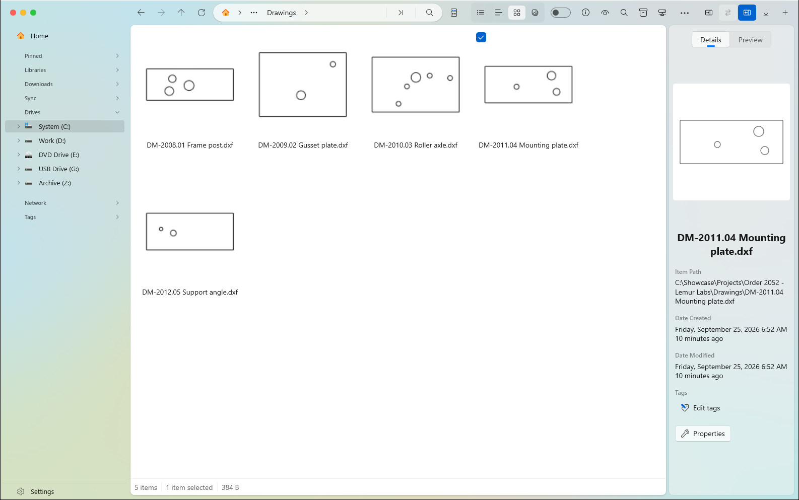

*Папка с чертежами развёрток DXF — ни одна CAD-программа не запущена и не установлена.*

## Сборка Inventor открывается как папка

**Задача.** Сборка Inventor — один файл `.iam`, но по сути это ссылки на множество деталей, разбросанных по диску. Проводник показывает один файл и ничего не говорит о его составе и о том, все ли детали ещё на месте.

**Действие.** Откройте сборку так же, как открываете папку.

**Результат.** Внутри — детали и подсборки, на которые она действительно ссылается: настоящие файлы на своих местах. В колонках — обозначение, материал, масса и версия Inventor, в которой файл сохранён последний раз; по ним можно фильтровать. Если файл по ссылке не найден на диске, он отмечается как отсутствующий, а не молча исчезает из списка.

**Ограничения.** Детали не копируются и не перемещаются внутрь сборки. Это представление того, что есть на диске, а не контейнер.

**Чем проверено.**

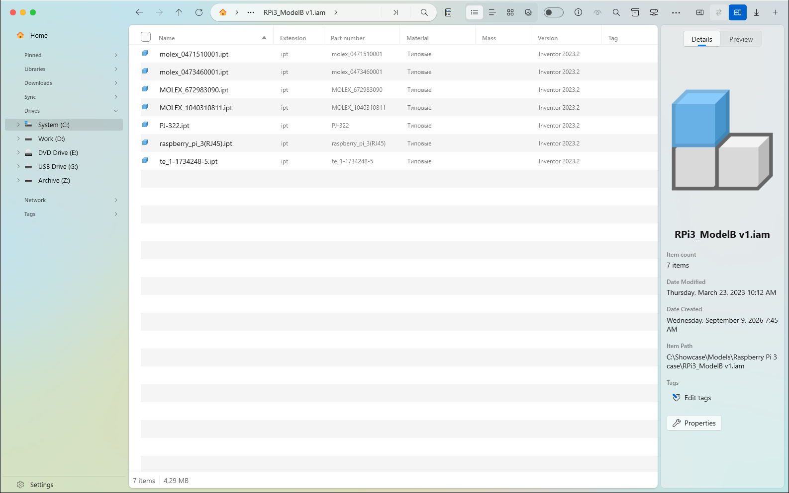

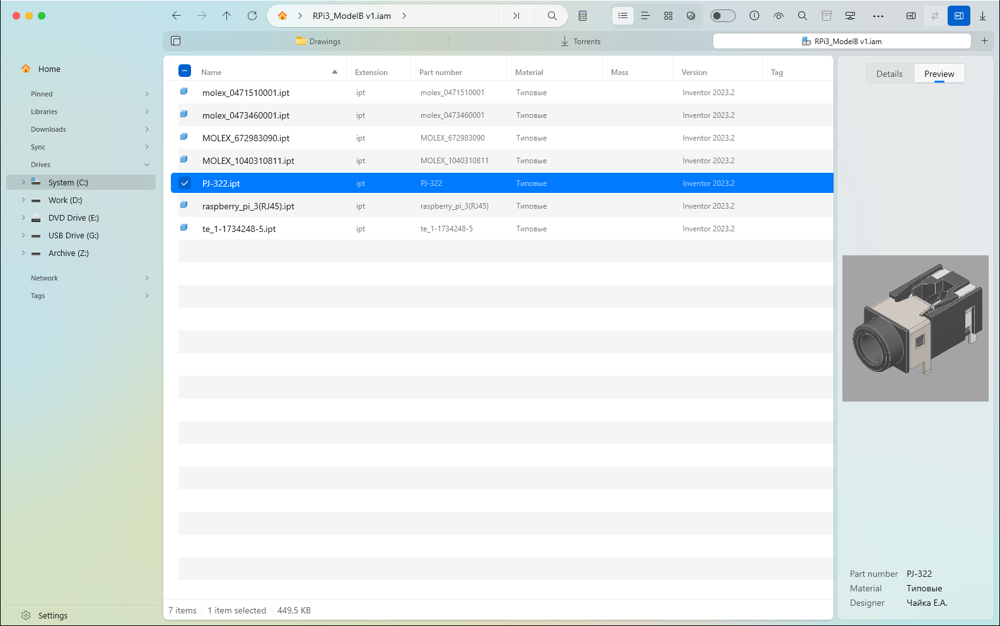

## Свойства деталей в колонках

Обозначение, материал, масса и точная версия CAD-программы, в которой файл сохранён последний раз, читаются из файлов, где эти сведения есть. Они показываются рядом с обычными именем и датой — в колонках с сортировкой и фильтрами. Это полезно, как только деталей в папке становится больше нескольких и нужно найти «ту алюминиевую» или «всё, что сохранено в версии 2023».

## Макеты: Illustrator и CorelDRAW

**Задача.** Задание на резку или гравировку приходит файлом `.ai` или `.cdr`, а на компьютере у станка не установлены ни Illustrator, ни CorelDRAW. В папке — пустой значок.

**Действие.** Посмотрите файл в панели просмотра, как любой другой.

**Результат.** Видно макет: страницу для Illustrator, сохранённую картинку для CorelDRAW. Ни одна из программ не запускается, и ничего внутри файла не исполняется.

**Как устроено.** Файл Illustrator, сохранённый обычным способом — по умолчанию ещё с ранних версий, — внутри представляет собой PDF. Его первая страница и есть макет, который рисует встроенный движок PDF в Windows. CorelDRAW хранит свою картинку внутри файла, но её место и способ хранения зависят от поколения формата. Новые документы — ZIP-архивы с картинкой в `previews/thumbnail.png`; у более старых другая структура архива, а картинка лежит в `metadata/thumbnails/thumbnail.bmp`. Самые старые — контейнеры RIFF без архивной упаковки. Чтобы извлечь из них картинку, пришлось учесть четырёхбайтовое поле типа формы в заголовке: при простом последовательном чтении оно ошибочно разбирается как часть следующих данных.

**Ограничения.** Старые файлы Illustrator на основе PostScript, без совместимости с PDF, не читаются: внутри нет PDF, который можно отрисовать. Обычный EPS пока не поддерживается. Во всех проверенных EPS-файлах — их было пять, включая общедоступные образцы — встроенной картинки не оказалось. Я не стал писать обработку, которую не на чем проверить.

**Чем проверено.** Проверял на собственном файле Illustrator одного из читателей, двух документах CorelDRAW разных поколений и общедоступном образце Corel. На снимке ниже — файл Illustrator и [образец из официального учебника Corel](https://product.corel.com/en/draw/10/Tutorials/Rave/html_docs/htmlpics/CoffeeShop.cdr), оба показаны в папке. Ни CorelDRAW, ни Illustrator на этом компьютере не установлены.

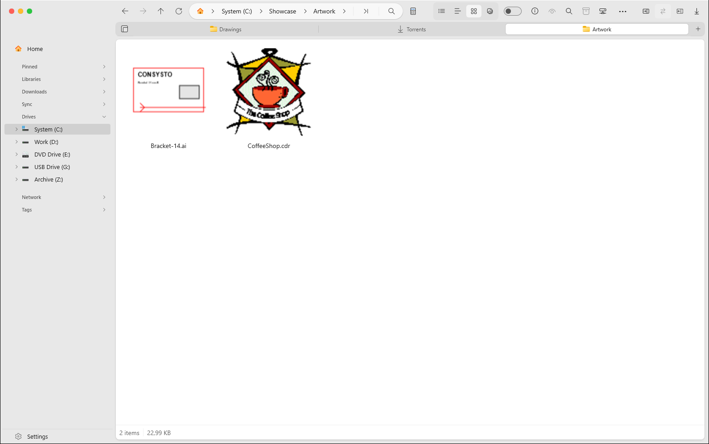

## Задания 3D-печати

**Задача.** Папка с заданиями на печать выглядит как тридцать одинаковых значков G-code. Какой из файлов «Плитка 1», «Плитка 2» и «Плитка 3» нужен и сколько он печатается — знает только слайсер, и приходится снова его открывать.

**Действие.** Откройте папку, выберите задание и посмотрите в панель просмотра.

**Результат.** У каждого задания видна миниатюра, которую сохранил слайсер. Обычный файл G-code панель просмотра рисует по траектории сопла: изометрия, цвет от стола до верхнего слоя, возможность увеличить изображение. Рядом — время печати, пластик (граммы, тип, метры), высота слоя, число слоёв, сопло, принтер и слайсер. В таблице появляется колонка «Время печати» рядом с материалом, массой и версией, поэтому задания можно отсортировать по длительности или расходу пластика. Колонка обозначения, которая у заданий печати пустая, в такой папке не показывается.

**Как устроено.** Слайсеры записывают эти сведения в комментариях: миниатюру PNG, JPEG или QOI в base64 между `; thumbnail begin` и `; thumbnail end`, настройки и расчётные значения — строками `key = value`. Читаются только первый мегабайт и последние полмегабайта файла, где слайсеры всё это хранят, поэтому папка с большими заданиями открывается быстро. Миниатюры QOI декодируются и перекодируются в PNG: средства просмотра изображений Windows не знают этот формат. Нарезанный `.gcode.3mf` — это ZIP: G-code стола читается из него потоком, без распаковки всего файла, а картинка стола берётся из `Metadata/plate_1.png`. Двоичный `.bgcode` PrusaSlicer разбирается блок за блоком для извлечения миниатюр и метаданных; у FlashPrint `.gx` картинка BMP записана перед G-code. При отрисовке траектории учитываются только движения с подачей пластика, соблюдаются абсолютный и относительный режимы, дуги G2/G3 разбиваются на точки, а линия прочистки сопла перед первым слоем отбрасывается. В очень больших заданиях часть слоёв пропускается, но верхний всегда сохраняется целиком — это ограничивает расход памяти и объём отрисовки. Переключение на другой файл отменяет текущую отрисовку.

**Ограничения.** Метаданные `.bgcode`, сжатые алгоритмом heatshrink, пропускаются, но миниатюры читаются. Сам `.bgcode` показывается миниатюрой, а не отрисовывается по траектории. Если `.gcode.3mf` сохранён, но ещё не нарезан, внутри нет G-code: видна модель, но нет сведений о печати. Просмотр траектории — это предпросмотр, а не симуляция: ширина линий и холостые перемещения не показываются.

**Чем проверено.** Проверял на реальных заданиях из Flash Studio 1.7.13 и Orca-Flashforge 1.6.2 для Flashforge Adventurer 5M, в форматах `.gcode` и `.gcode.3mf`: у детали из 45 слоёв прочитаны 1 ч 3 мин, 20 г PETG и слой 0,2 мм, у проекта из 152 слоёв — 3 ч 48 мин и 197 г. Дуги, испорченные числовые поля и формат Orca с двумя значениями времени в одной строке проверены на файлах, сделанных вручную. Чтение форматов PrusaSlicer, Bambu Studio, Cura и FlashPrint написано по опубликованному описанию их выходных файлов, но на реальных файлах этих программ пока не проверялось.

## Коллекции

**Задача.** Нужные вам файлы — растущая библиотека деталей, фотографий, книг или музыки — разбросаны по папкам. А понятия «моя коллекция», объединяющего несколько папок, у Проводника нет.

**Действие.** Укажите для коллекции одну или несколько папок.

**Результат.** По ним строится указатель: видно ход работы и папку, которая сейчас обрабатывается. Ни один файл не перемещается и не копируется. Дубликаты находятся сравнением по пробам содержимого, а не только по совпадению имён.

С элементами коллекции работают как с файлами в папке: выделяют щелчком, с Ctrl, Shift или Ctrl+A, а можно галочкой в углу плитки, вообще без клавиш. Выбранное можно скопировать, вырезать, удалить, открыть, показать в папке или скопировать путь — кнопками над списком, из контекстного меню или клавишами (Enter, Delete, Shift+Delete, Ctrl+C, Ctrl+X, Ctrl+Shift+C, Esc). В буфер обмена попадают сами файлы, поэтому вставить их можно в любую папку — в этой программе или в Проводнике; их также можно перетаскивать мышью. Кнопка информационной панели показывает выбранный элемент крупно, со сведениями. Выделение сохраняется при фоновом повторном сканировании и переключении между списком и плитками.

**Ограничения.** Вставка *в* коллекцию не поддерживается: коллекция объединяет несколько папок, и пока не очевидно, в какую из них помещать файлы. Переименования со страницы коллекции тоже пока нет.

**Чем проверено.** Коллекция из нескольких папок с проектами заказчиков собрала в указатель 543 чертежа с предпросмотром, материалами и фильтрами по форматам — это видно на уже имеющемся снимке в [README](../README.ru.md). Выделение и операции с файлами проверены на демонстрационной коллекции из 36 сгенерированных картинок.

## Книги и OPDS

**Задача.** Собрание электронных книг остаётся просто файлами в папке, пока кто-нибудь не прочитает их метаданные. А чтобы перенести свои книги на телефон, обычно нужна отдельная программа синхронизации.

**Действие и результат.** Обложки и сведения читаются из FB2, EPUB, MOBI, PDF и DjVu. Клиент OPDS позволяет просматривать чужие общедоступные каталоги и скачивать из них книги прямо в файловом менеджере. Сервер OPDS делает обратное: раздаёт вашу книжную коллекцию по локальной сети. Любая читалка на телефоне с поддержкой OPDS — FBReader, Librera и другие — может просматривать её и скачивать книги напрямую, без установки отдельной программы на компьютер.

**Ограничения.** Сервер OPDS пока не проверен с настоящей читалкой на телефоне — прямо отмечаю это здесь.

**Чем проверено.** Общедоступный каталог OPDS проекта Gutenberg, открытый вживую: список книг, страница книги с обложкой и ссылки на скачивание EPUB/MOBI.

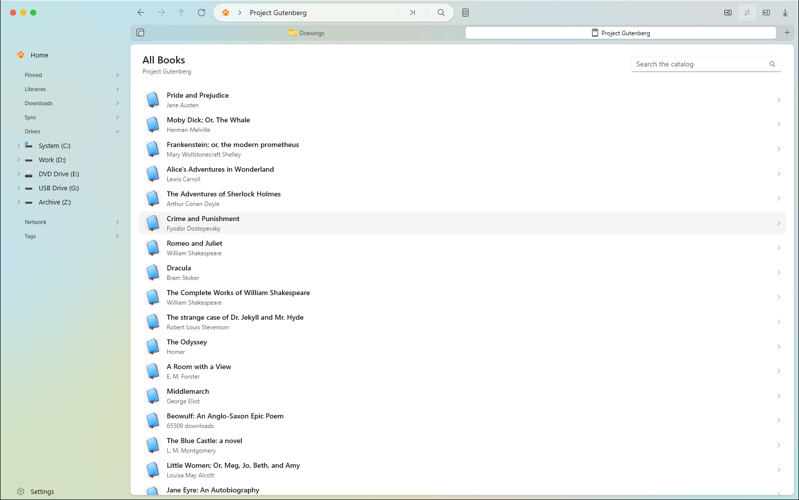

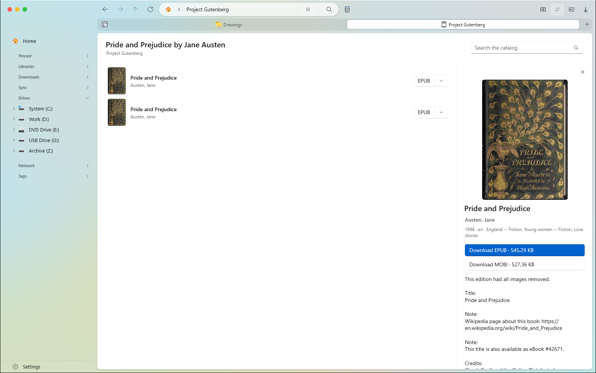

## Медиа: фотографии и музыка

При просмотре фотографий читается EXIF, при просмотре музыки — теги ID3, FLAC, Ogg и MP4. Эти сведения попадают в ту же систему коллекций и колонок, что и всё остальное. Музыкальная библиотека или фототека — такая же коллекция, как библиотека чертежей, с фильтрами по своим метаданным.

## Терминал во вкладке

Настоящая консоль Windows открывается обычной вкладкой рядом с папками и сразу в той папке, из которой её вызвали. Не нужно следить за отдельным окном терминала и вручную вводить `cd`.

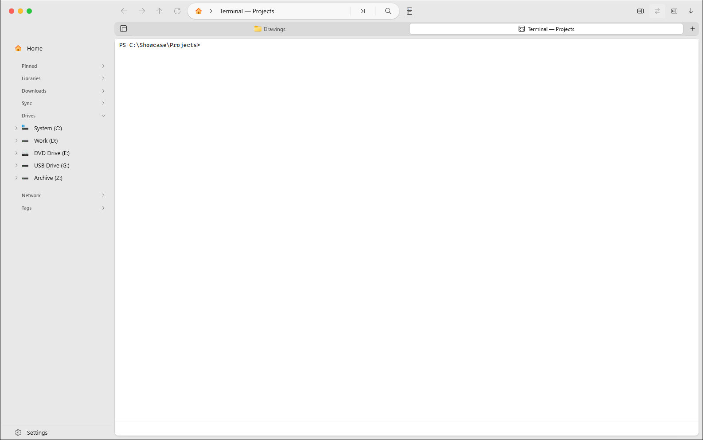

## Торренты

**Задача.** Чтобы скачать что-то большое, обычно нужна отдельная программа, отдельное окно и ещё одно место, куда надо не забывать заглядывать.

**Действие и результат.** Магнет-ссылки и файлы `.torrent` открываются прямо в разделе торрентов внутри файлового менеджера: список загрузок, файлы каждой загрузки, пиры и трекеры, скорость и оставшееся время.

**Ограничения.** Это клиент для того, что вы уже собирались скачать, а не инструмент поиска: программа ничего не ищет и не предлагает.

**Чем проверено.** Настоящая загрузка — общедоступный установочный образ Debian — со скоростью примерно 8 МБ/с. Видны сиды и пиры, оставшееся время уменьшается.

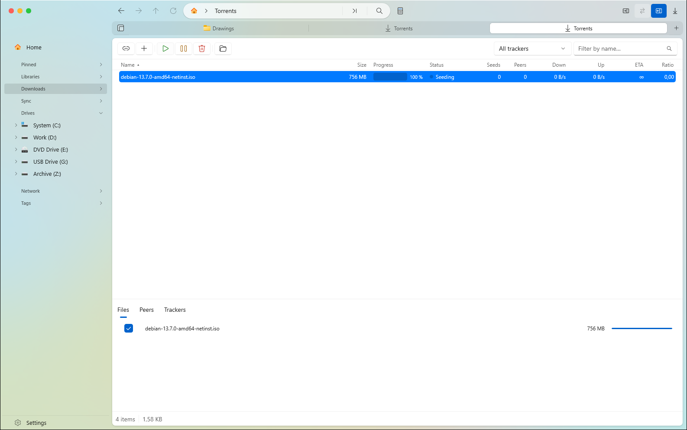

## Синхронизация и резервные копии

**Задача.** На вопрос «А последние изменения я точно сохранил в резервной копии?» обычно отвечают повторным копированием всего подряд в надежде, что теперь точно сохранили, или сравнением дат файлов на глаз.

**Действие.** Сравните две папки или настройте между ними постоянный план резервного копирования.

**Результат.** Ещё до копирования видно, что появилось, что изменилось и что есть только с одной стороны, — по каждому файлу. Для любого отдельного элемента можно сменить направление копирования до запуска операции.

**Чем проверено.** Сравнение папки проекта с её резервной копией верно нашло один изменённый и один отсутствующий файл среди нескольких одинаковых. Проверка плана резервного копирования показала 11 файлов к копированию с разделением на новые и изменённые — до какой-либо записи.

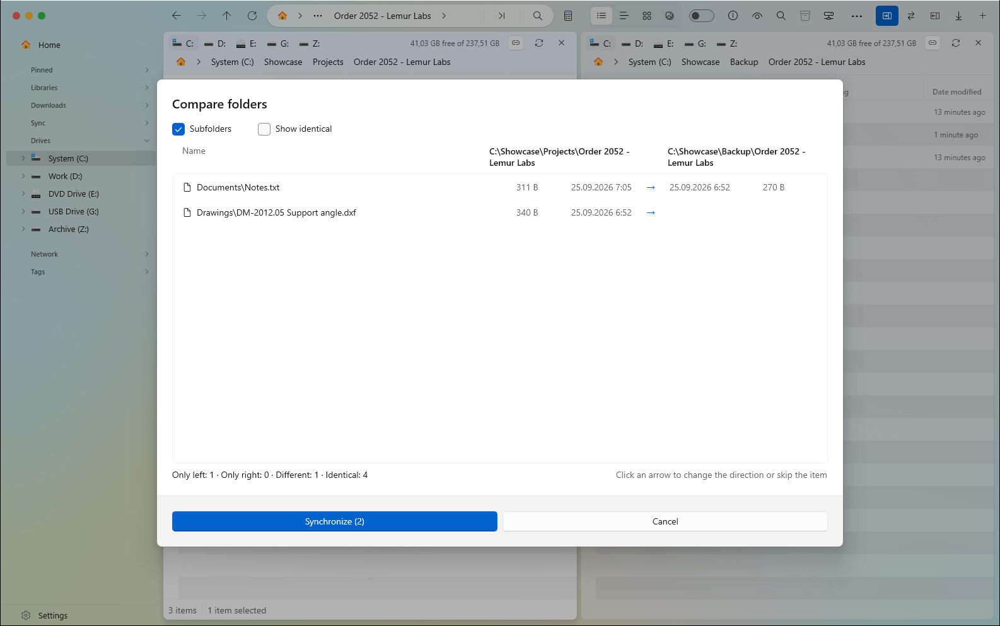

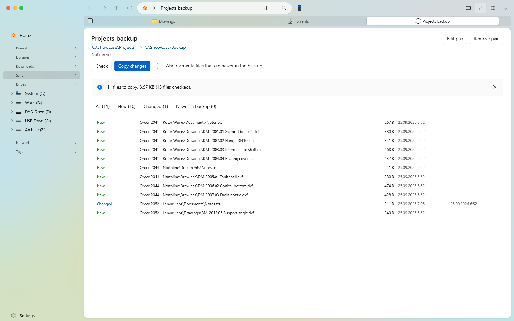

## Две панели

Две панели уже есть в Files. Этот форк добавляет то, к чему привыкли пользователи Total Commander и Norton Commander: шапку над каждой панелью с диском и свободным местом, обмен панелей местами, синхронное перемещение по папкам, копирование или перемещение в другую панель одним действием и описанное выше сравнение папок.

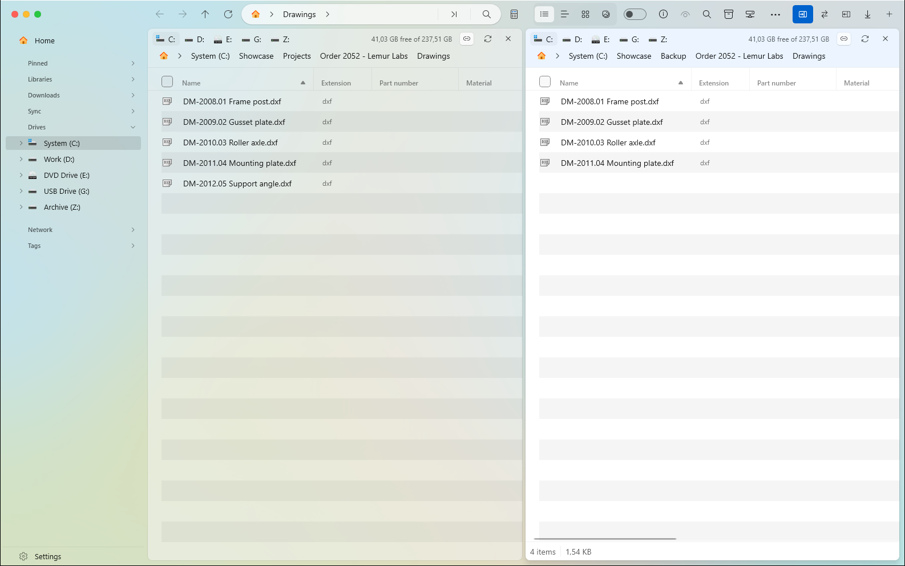

## Два стиля оформления

По умолчанию окно оформлено в духе Finder на macOS: круглые кнопки окна слева, вкладки как в Safari, строки через одну подкрашены. В «Настройки → Внешний вид → Стиль оформления» можно выбрать обычный вид Windows 11: кнопки окна справа, стандартные вкладки всегда видны, системные цвета выделения, без чередования цвета строк. Изменение применяется после перезапуска, кнопка «Перезапустить» появляется там же.

## Быстрый просмотр

Нажмите Пробел или F3 на выбранном файле, чтобы увидеть его в полном размере поверх окна, не открывая вкладку или отдельную программу. Это тот же способ быстрого просмотра, который в других файловых менеджерах устроен по образцу Quick Look.

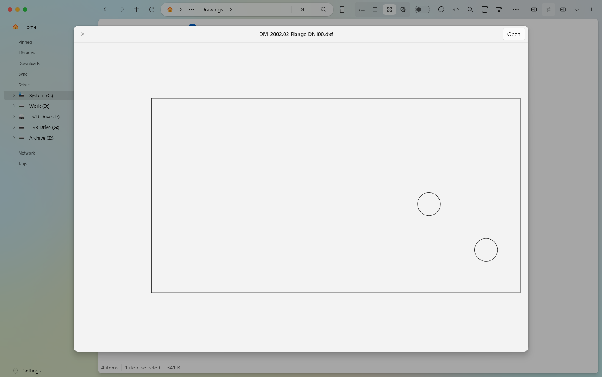

## Управление из других программ

**Задача.** Иногда нужно, чтобы файловым менеджером управляла другая программа — скрипт, инструмент сборки или ваша автоматизация: открывала нужную папку, включала две панели, запускала загрузку, без ручных щелчков.

**Действие и результат.** Локальный канал управления принимает команды в JSON: открыть путь, включить две панели, открыть терминал или загрузки, создать коллекцию или план резервного копирования, запустить торрент или вызвать по имени любую собственную команду программы. Подключиться можно двумя способами: через именованный канал, доступный только учётной записи, от которой запущена программа, без доступа по сети, или через необязательный локальный HTTP-интерфейс с защитой файлом ключа — для скриптов на любом языке.

**Ограничения.** По умолчанию выключено; включается в «Настройки → Дополнительно». См. [полный справочник команд](../build/consysto/api/README.md).

## Безопасность и ограничения

При создании предпросмотра закрытых сторонних форматов программа при ошибке прекращает обработку, а не пытается что-либо исполнить: содержимое CAD-файла, макета или архива только читается, но не запускается. Тяжёлые преобразования — разбиение STEP/IGES на треугольники и вспомогательная программа для SolidWorks/КОМПАС — работают отдельными процессами, вне основного окна. Известные недоработки называю прямо: сигнал отмены пока доходит не до каждого этапа загрузки CAD-предпросмотра, поэтому чтение огромного файла не всегда можно прервать; миниатюры и полный предпросмотр пока не строятся отдельно, из-за чего просмотр папки с большими моделями может быть медленнее, чем должен; а сообщения для пользователя пока не различают «файл отсутствует», «формат не распознан» и «файл повреждён».

## Портативная версия

Распакуйте архив в любую папку и запустите `Files.exe`. Без установки и прав администратора, без записи в реестр или профиль пользователя. Всё, что программа сохраняет, лежит в папке `data` рядом с ней; удаление этой папки убирает все её следы. Нужна Windows 11 или Windows 10 1809+; все библиотеки лежат в папке программы, кроме компонента WebView2 для терминала: в Windows 11 он есть всегда, в Windows 10 может отсутствовать.

**Ограничения.** Портативная версия не заменяет Проводник по Win+E, не показывает уведомления Windows и не обновляется сама. Обновление — заменой папки; папка `data` сохраняет ваши настройки при переходе на новую версию.

## Чего пока нет

Перечисляю прямо: честно описанное ограничение полезнее, чем умолчание о нём.

- **Creo** открывается, но возвращает сломанную геометрию, поэтому его поддержка выключена.
- **Обычный EPS** не содержал встроенного предпросмотра ни в одном из проверенных файлов; обработка, которую не на чем проверить, не писалась.
- **Старые файлы Illustrator без совместимости с PDF** не читаются.
- **Сервер OPDS** пока не проверен с настоящей читалкой на телефоне.
- **3D-печать**: метаданные `.bgcode`, сжатые heatshrink, не читаются; чтение форматов PrusaSlicer, Bambu Studio, Cura и FlashPrint пока не проверено на реальных файлах этих программ.
- **Коллекции**: нет вставки в коллекцию и переименования с её страницы.
- Три известные недоработки загрузки CAD-предпросмотра перечислены выше, в разделе [Безопасность и ограничения](#безопасность-и-ограничения), чтобы вам не пришлось обнаруживать их самим.

## Лицензии и благодарности

Основа — [Files](https://github.com/files-community/Files) от Files Community под MPL-2.0 (`LICENSE-MPL`); отдельные части — под MIT (`LICENSE-MIT`). Проект не связан с Files Community и не поддерживается ими: за все шероховатости здесь отвечаю я, а не они. Геометрию SolidWorks и КОМПАС-3D читает [cadmpeg](https://github.com/cadmpeg/cadmpeg) (Apache-2.0), отдельный вспомогательный процесс. Спасибо также авторам ACadSharp, MonoTorrent, OpenMcdf, Win2D и CommunityToolkit, на которых держится часть этой работы.

[**Скачать готовую сборку**](https://github.com/egorcha174/ConsystoFiles/releases) · [Назад к README](../README.ru.md)
